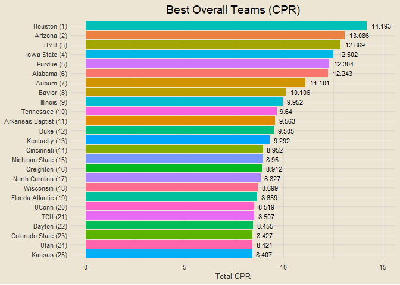
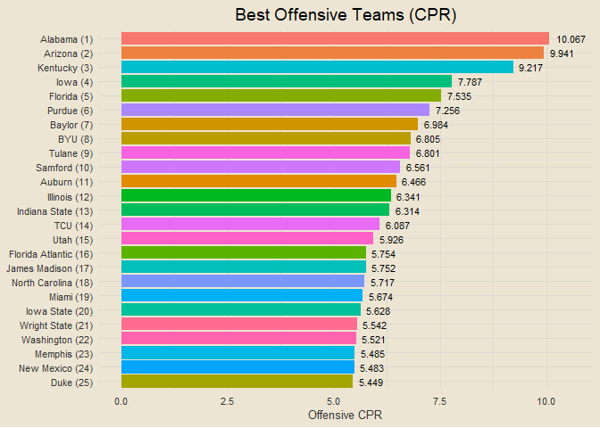

``` r
opening_day = as_date("2023-11-06")
today = Sys.Date()
season_dates = as.character(seq.Date(from = opening_day, to = today, by = 1))

# res = read_csv("data/end_games.csv", show_col_types = F)

res = data.frame()

for (date in season_dates) {
  new = get_master_schedule(date)
  res = rbind(res, new)
}

# write_csv(res, "data/end_games.csv")

end = res |>
  filter(!is.na(home_score)) |>
  mutate(win_team = ifelse(home_score > away_score, home, away),
         lose_team = ifelse(home_score > away_score, away, home),
         win_score = ifelse(home_score > away_score, home_score, away_score),
         lose_score = ifelse(home_score > away_score, away_score, home_score))

all_teams = sort(unique(c(unique(end$win_team), unique(end$lose_team))))

team_records = data.frame(team = all_teams) |>
  left_join(end |>
  count(win_team) |>
  setNames(c("team", "wins")), by = "team") |>
  left_join(end |>
  count(lose_team) |>
  setNames(c("team", "losses")), by = "team") |>
  mutate(wins = replace_na(wins, 0),
         losses = replace_na(losses, 0),
         games = wins + losses,
         win_pct = round(wins / games, 3)) |>
  arrange(desc(win_pct), desc(wins))

team_records |>
  filter(games >= 8)
```

    ##                         team wins losses games win_pct
    ## 1                    Houston   11      0    11   1.000
    ## 2              James Madison   10      0    10   1.000
    ## 3                   Oklahoma   10      0    10   1.000
    ## 4                   Ole Miss   10      0    10   1.000
    ## 5                   Longwood   12      1    13   0.923
    ## 6          Purdue Fort Wayne   11      1    12   0.917
    ## 7                 Utah State   11      1    12   0.917
    ## 8                        BYU   10      1    11   0.909
    ## 9             Colorado State   10      1    11   0.909
    ## 10                     Drake   10      1    11   0.909
    ## 11             Indiana State   10      1    11   0.909
    ## 12                    Kansas   10      1    11   0.909
    ## 13                New Mexico   10      1    11   0.909
    ## 14                 Princeton   10      1    11   0.909
    ## 15                    Purdue   10      1    11   0.909
    ## 16                     UConn   10      1    11   0.909
    ## 17                    Baylor    9      1    10   0.900
    ## 18                   Clemson    9      1    10   0.900
    ## 19              Grand Canyon    9      1    10   0.900
    ## 20                    Nevada    9      1    10   0.900
    ## 21            South Carolina    9      1    10   0.900
    ## 22                  Virginia    9      1    10   0.900
    ## 23                   Arizona    8      1     9   0.889
    ## 24                       TCU    8      1     9   0.889
    ## 25                   McNeese   10      2    12   0.833
    ## 26                   Samford   10      2    12   0.833
    ## 27         Appalachian State    9      2    11   0.818
    ## 28                    Butler    9      2    11   0.818
    ## 29                 Creighton    9      2    11   0.818
    ## 30                Evansville    9      2    11   0.818
    ## 31          Florida Atlantic    9      2    11   0.818
    ## 32         George Washington    9      2    11   0.818
    ## 33                Iowa State    9      2    11   0.818
    ## 34                 Marquette    9      2    11   0.818
    ## 35         Mississippi State    9      2    11   0.818
    ## 36                  Nebraska    9      2    11   0.818
    ## 37                Ohio State    9      2    11   0.818
    ## 38                Providence    9      2    11   0.818
    ## 39            Saint Joseph's    9      2    11   0.818
    ## 40                    Auburn    8      2    10   0.800
    ## 41                Cincinnati    8      2    10   0.800
    ## 42                  Colorado    8      2    10   0.800
    ## 43                    Dayton    8      2    10   0.800
    ## 44                  Duquesne    8      2    10   0.800
    ## 45              George Mason    8      2    10   0.800
    ## 46                  Illinois    8      2    10   0.800
    ## 47                  Kentucky    8      2    10   0.800
    ## 48                   Memphis    8      2    10   0.800
    ## 49                     Miami    8      2    10   0.800
    ## 50              Northwestern    8      2    10   0.800
    ## 51           San Diego State    8      2    10   0.800
    ## 52                     Texas    8      2    10   0.800
    ## 53                Texas Tech    8      2    10   0.800
    ## 54                    Tulane    8      2    10   0.800
    ## 55            UNC Greensboro    8      2    10   0.800
    ## 56            UNC Wilmington    8      2    10   0.800
    ## 57                      Utah    8      2    10   0.800
    ## 58          Washington State    8      2    10   0.800
    ## 59          Western Carolina    8      2    10   0.800
    ## 60                   Cornell    7      2     9   0.778
    ## 61                   Hawai'i    7      2     9   0.778
    ## 62                    Marist    7      2     9   0.778
    ## 63                   Liberty    9      3    12   0.750
    ## 64            Louisiana Tech    9      3    12   0.750
    ## 65            Portland State    9      3    12   0.750
    ## 66          Youngstown State    9      3    12   0.750
    ## 67             Massachusetts    6      2     8   0.750
    ## 68                Ball State    8      3    11   0.727
    ## 69               Boise State    8      3    11   0.727
    ## 70            Boston College    8      3    11   0.727
    ## 71             Bowling Green    8      3    11   0.727
    ## 72                  Columbia    8      3    11   0.727
    ## 73                  Davidson    8      3    11   0.727
    ## 74                  Delaware    8      3    11   0.727
    ## 75                   Gonzaga    8      3    11   0.727
    ## 76              Kansas State    8      3    11   0.727
    ## 77            Kennesaw State    8      3    11   0.727
    ## 78                  La Salle    8      3    11   0.727
    ## 79                 Minnesota    8      3    11   0.727
    ## 80            Morehead State    8      3    11   0.727
    ## 81                Pittsburgh    8      3    11   0.727
    ## 82                Quinnipiac    8      3    11   0.727
    ## 83                  Syracuse    8      3    11   0.727
    ## 84            Tarleton State    8      3    11   0.727
    ## 85                 Tennessee    8      3    11   0.727
    ## 86             Virginia Tech    8      3    11   0.727
    ## 87             Wichita State    8      3    11   0.727
    ## 88                 Wisconsin    8      3    11   0.727
    ## 89                     Akron    7      3    10   0.700
    ## 90      Cal State Northridge    7      3    10   0.700
    ## 91        California Baptist    7      3    10   0.700
    ## 92               Chattanooga    7      3    10   0.700
    ## 93                      Duke    7      3    10   0.700
    ## 94                   Florida    7      3    10   0.700
    ## 95                   Georgia    7      3    10   0.700
    ## 96                   Harvard    7      3    10   0.700
    ## 97                   Indiana    7      3    10   0.700
    ## 98                Kent State    7      3    10   0.700
    ## 99                  NC State    7      3    10   0.700
    ## 100           North Carolina    7      3    10   0.700
    ## 101                   Oregon    7      3    10   0.700
    ## 102             Oregon State    7      3    10   0.700
    ## 103                  Rutgers    7      3    10   0.700
    ## 104          St. Bonaventure    7      3    10   0.700
    ## 105               St. John's    7      3    10   0.700
    ## 106                      UCF    7      3    10   0.700
    ## 107              Wake Forest    7      3    10   0.700
    ## 108               Washington    7      3    10   0.700
    ## 109                  Radford    9      4    13   0.692
    ## 110                  Belmont    8      4    12   0.667
    ## 111               High Point    8      4    12   0.667
    ## 112             Jacksonville    8      4    12   0.667
    ## 113             North Dakota    8      4    12   0.667
    ## 114                San Diego    8      4    12   0.667
    ## 115            San Francisco    8      4    12   0.667
    ## 116              Santa Clara    8      4    12   0.667
    ## 117                  Vermont    8      4    12   0.667
    ## 118         Western Kentucky    8      4    12   0.667
    ## 119                 Winthrop    8      4    12   0.667
    ## 120             Georgia Tech    6      3     9   0.667
    ## 121                    Tulsa    6      3     9   0.667
    ## 122         UC Santa Barbara    6      3     9   0.667
    ## 123                Air Force    7      4    11   0.636
    ## 124                 Arkansas    7      4    11   0.636
    ## 125               Charleston    7      4    11   0.636
    ## 126               Georgetown    7      4    11   0.636
    ## 127                  Hofstra    7      4    11   0.636
    ## 128           Illinois State    7      4    11   0.636
    ## 129         Long Beach State    7      4    11   0.636
    ## 130                 Missouri    7      4    11   0.636
    ## 131           Missouri State    7      4    11   0.636
    ## 132            New Hampshire    7      4    11   0.636
    ## 133               Seton Hall    7      4    11   0.636
    ## 134                      SMU    7      4    11   0.636
    ## 135             South Dakota    7      4    11   0.636
    ## 136                Texas A&M    7      4    11   0.636
    ## 137                UC Irvine    7      4    11   0.636
    ## 138                      UIC    7      4    11   0.636
    ## 139             UMass Lowell    7      4    11   0.636
    ## 140                Villanova    7      4    11   0.636
    ## 141                    Maine    8      5    13   0.615
    ## 142            Norfolk State    8      5    13   0.615
    ## 143                  Alabama    6      4    10   0.600
    ## 144            Arizona State    6      4    10   0.600
    ## 145               Binghamton    6      4    10   0.600
    ## 146     East Tennessee State    6      4    10   0.600
    ## 147                 Maryland    6      4    10   0.600
    ## 148                  Montana    6      4    10   0.600
    ## 149        Northern Illinois    6      4    10   0.600
    ## 150                     Ohio    6      4    10   0.600
    ## 151        Southern Illinois    6      4    10   0.600
    ## 152                   Temple    6      4    10   0.600
    ## 153                   Toledo    6      4    10   0.600
    ## 154             UT Arlington    6      4    10   0.600
    ## 155              Weber State    6      4    10   0.600
    ## 156                  Wyoming    6      4    10   0.600
    ## 157          Cleveland State    7      5    12   0.583
    ## 158                   Denver    7      5    12   0.583
    ## 159                   Drexel    7      5    12   0.583
    ## 160         Loyola Marymount    7      5    12   0.583
    ## 161       North Dakota State    7      5    12   0.583
    ## 162            North Florida    7      5    12   0.583
    ## 163        Northern Kentucky    7      5    12   0.583
    ## 164             Pennsylvania    7      5    12   0.583
    ## 165             Presbyterian    7      5    12   0.583
    ## 166              Saint Louis    7      5    12   0.583
    ## 167         SIU Edwardsville    7      5    12   0.583
    ## 168     St. Thomas-Minnesota    7      5    12   0.583
    ## 169          Tennessee State    7      5    12   0.583
    ## 170                     Yale    7      5    12   0.583
    ## 171            South Florida    5      4     9   0.556
    ## 172                 Stanford    5      4     9   0.556
    ## 173                     UCLA    5      4     9   0.556
    ## 174                  Bradley    6      5    11   0.545
    ## 175      Cal State Fullerton    6      5    11   0.545
    ## 176                 Canisius    6      5    11   0.545
    ## 177                  Colgate    6      5    11   0.545
    ## 178            East Carolina    6      5    11   0.545
    ## 179                     Elon    6      5    11   0.545
    ## 180             Fresno State    6      5    11   0.545
    ## 181                    Idaho    6      5    11   0.545
    ## 182                     Iowa    6      5    11   0.545
    ## 183                Louisiana    6      5    11   0.545
    ## 184           Loyola Chicago    6      5    11   0.545
    ## 185                      LSU    6      5    11   0.545
    ## 186                 Michigan    6      5    11   0.545
    ## 187           Michigan State    6      5    11   0.545
    ## 188                 Monmouth    6      5    11   0.545
    ## 189         Northern Arizona    6      5    11   0.545
    ## 190                 Richmond    6      5    11   0.545
    ## 191             Saint Mary's    6      5    11   0.545
    ## 192                Seattle U    6      5    11   0.545
    ## 193            South Alabama    6      5    11   0.545
    ## 194       South Dakota State    6      5    11   0.545
    ## 195            Southern Miss    6      5    11   0.545
    ## 196                  Stetson    6      5    11   0.545
    ## 197              Stony Brook    6      5    11   0.545
    ## 198              Texas State    6      5    11   0.545
    ## 199              The Citadel    6      5    11   0.545
    ## 200                      UAB    6      5    11   0.545
    ## 201                  UAlbany    6      5    11   0.545
    ## 202             UC San Diego    6      5    11   0.545
    ## 203              Utah Valley    6      5    11   0.545
    ## 204                     UTEP    6      5    11   0.545
    ## 205                      VCU    6      5    11   0.545
    ## 206                  Wofford    6      5    11   0.545
    ## 207                   Xavier    6      5    11   0.545
    ## 208                   Bryant    7      6    13   0.538
    ## 209                 Lipscomb    7      6    13   0.538
    ## 210                 Campbell    6      6    12   0.500
    ## 211         Eastern Illinois    6      6    12   0.500
    ## 212      Fairleigh Dickinson    6      6    12   0.500
    ## 213              Little Rock    6      6    12   0.500
    ## 214            North Alabama    6      6    12   0.500
    ## 215                  Oakland    6      6    12   0.500
    ## 216                    Omaha    6      6    12   0.500
    ## 217                 Portland    6      6    12   0.500
    ## 218        Queens University    6      6    12   0.500
    ## 219              Sam Houston    6      6    12   0.500
    ## 220           San José State    6      6    12   0.500
    ## 221       Texas A&M-Commerce    6      6    12   0.500
    ## 222            UNC Asheville    6      6    12   0.500
    ## 223                UT Martin    6      6    12   0.500
    ## 224         Western Illinois    6      6    12   0.500
    ## 225          Bethune-Cookman    5      5    10   0.500
    ## 226                Charlotte    5      5    10   0.500
    ## 227         Eastern Michigan    5      5    10   0.500
    ## 228              North Texas    5      5    10   0.500
    ## 229           Oklahoma State    5      5    10   0.500
    ## 230         Prairie View A&M    5      5    10   0.500
    ## 231        Stephen F. Austin    5      5    10   0.500
    ## 232                     Troy    5      5    10   0.500
    ## 233                      USC    5      5    10   0.500
    ## 234             Wright State    5      5    10   0.500
    ## 235              Austin Peay    6      7    13   0.462
    ## 236        Abilene Christian    5      6    11   0.455
    ## 237      American University    5      6    11   0.455
    ## 238                Fairfield    5      6    11   0.455
    ## 239                  Fordham    5      6    11   0.455
    ## 240                   Furman    5      6    11   0.455
    ## 241            Georgia State    5      6    11   0.455
    ## 242                    Lamar    5      6    11   0.455
    ## 243               Lindenwood    5      6    11   0.455
    ## 244               Louisville    5      6    11   0.455
    ## 245                Merrimack    5      6    11   0.455
    ## 246         Middle Tennessee    5      6    11   0.455
    ## 247              New Orleans    5      6    11   0.455
    ## 248               Penn State    5      6    11   0.455
    ## 249             Rhode Island    5      6    11   0.455
    ## 250                     Rice    5      6    11   0.455
    ## 251 Texas A&M-Corpus Christi    5      6    11   0.455
    ## 252                   Towson    5      6    11   0.455
    ## 253                Utah Tech    5      6    11   0.455
    ## 254                     UTSA    5      6    11   0.455
    ## 255           William & Mary    5      6    11   0.455
    ## 256            Alabama State    4      5     9   0.444
    ## 257            Florida State    4      5     9   0.444
    ## 258                Manhattan    4      5     9   0.444
    ## 259               Miami (OH)    4      5     9   0.444
    ## 260            Montana State    4      5     9   0.444
    ## 261            Saint Peter's    4      5     9   0.444
    ## 262                 UC Davis    4      5     9   0.444
    ## 263                     UNLV    4      5     9   0.444
    ## 264           Delaware State    6      8    14   0.429
    ## 265             Gardner-Webb    5      7    12   0.417
    ## 266                Green Bay    5      7    12   0.417
    ## 267       Jacksonville State    5      7    12   0.417
    ## 268              Kansas City    5      7    12   0.417
    ## 269                 Le Moyne    5      7    12   0.417
    ## 270                 Marshall    5      7    12   0.417
    ## 271         New Mexico State    5      7    12   0.417
    ## 272            Northern Iowa    5      7    12   0.417
    ## 273                 Southern    5      7    12   0.417
    ## 274           Tennessee Tech    5      7    12   0.417
    ## 275            Chicago State    6      9    15   0.400
    ## 276    Cal State Bakersfield    4      6    10   0.400
    ## 277      Central Connecticut    4      6    10   0.400
    ## 278         Eastern Kentucky    4      6    10   0.400
    ## 279       Eastern Washington    4      6    10   0.400
    ## 280              Idaho State    4      6    10   0.400
    ## 281                   Mercer    4      6    10   0.400
    ## 282         Mount St. Mary's    4      6    10   0.400
    ## 283                 Nicholls    4      6    10   0.400
    ## 284        Northern Colorado    4      6    10   0.400
    ## 285               Notre Dame    4      6    10   0.400
    ## 286             Oral Roberts    4      6    10   0.400
    ## 287                UL Monroe    4      6    10   0.400
    ## 288               Vanderbilt    4      6    10   0.400
    ## 289                   Wagner    4      6    10   0.400
    ## 290            West Virginia    4      6    10   0.400
    ## 291   North Carolina Central    5      8    13   0.385
    ## 292                  Pacific    5      8    13   0.385
    ## 293               Pepperdine    5      8    13   0.385
    ## 294                     UMBC    5      8    13   0.385
    ## 295           Arkansas State    4      7    11   0.364
    ## 296        Boston University    4      7    11   0.364
    ## 297                Dartmouth    4      7    11   0.364
    ## 298                  Hampton    4      7    11   0.364
    ## 299                     Iona    4      7    11   0.364
    ## 300            Jackson State    4      7    11   0.364
    ## 301                Milwaukee    4      7    11   0.364
    ## 302             Northeastern    4      7    11   0.364
    ## 303   South Carolina Upstate    4      7    11   0.364
    ## 304 Southeast Missouri State    4      7    11   0.364
    ## 305         St. Francis (PA)    4      7    11   0.364
    ## 306             UC Riverside    4      7    11   0.364
    ## 307               Bellarmine    4      8    12   0.333
    ## 308         Central Arkansas    4      8    12   0.333
    ## 309    Florida International    4      8    12   0.333
    ## 310                   Howard    4      8    12   0.333
    ## 311             Sacred Heart    4      8    12   0.333
    ## 312     UT Rio Grande Valley    4      8    12   0.333
    ## 313               Valparaiso    4      8    12   0.333
    ## 314         Central Michigan    3      6     9   0.333
    ## 315                     Navy    3      6     9   0.333
    ## 316                  Niagara    3      6     9   0.333
    ## 317             Old Dominion    3      6     9   0.333
    ## 318             Morgan State    4      9    13   0.308
    ## 319               California    3      7    10   0.300
    ## 320      Charleston Southern    3      7    10   0.300
    ## 321         Coastal Carolina    3      7    10   0.300
    ## 322           Incarnate Word    3      7    10   0.300
    ## 323            Southern Utah    3      7    10   0.300
    ## 324                 Bucknell    3      8    11   0.273
    ## 325                 Cal Poly    3      8    11   0.273
    ## 326             Murray State    3      8    11   0.273
    ## 327            Robert Morris    3      8    11   0.273
    ## 328             SE Louisiana    3      8    11   0.273
    ## 329                    Brown    3      9    12   0.250
    ## 330       Florida Gulf Coast    3      9    12   0.250
    ## 331                    IUPUI    3      9    12   0.250
    ## 332      Arkansas-Pine Bluff    3     10    13   0.231
    ## 333     South Carolina State    3     10    13   0.231
    ## 334              Florida A&M    2      7     9   0.222
    ## 335        Houston Christian    2      7     9   0.222
    ## 336                   Lehigh    2      7     9   0.222
    ## 337   Maryland-Eastern Shore    2      7     9   0.222
    ## 338                   DePaul    2      8    10   0.200
    ## 339                Grambling    2      8    10   0.200
    ## 340                     NJIT    2      8    10   0.200
    ## 341                    Rider    2      8    10   0.200
    ## 342         Sacramento State    2      8    10   0.200
    ## 343                    Siena    2      8    10   0.200
    ## 344         Western Michigan    2      8    10   0.200
    ## 345                     Army    2      9    11   0.182
    ## 346               Holy Cross    2      9    11   0.182
    ## 347       North Carolina A&T    2      9    11   0.182
    ## 348         Southern Indiana    2      9    11   0.182
    ## 349                      VMI    2     10    12   0.167
    ## 350                Stonehill    2     11    13   0.154
    ## 351           Texas Southern    1      8     9   0.111
    ## 352                  Buffalo    1      9    10   0.100
    ## 353   Long Island University    1      9    10   0.100
    ## 354              Alabama A&M    1     10    11   0.091
    ## 355             Alcorn State    1     10    11   0.091
    ## 356                Lafayette    1     10    11   0.091
    ## 357          Loyola Maryland    1     10    11   0.091
    ## 358       Northwestern State    1     10    11   0.091
    ## 359             Coppin State    1     11    12   0.083
    ## 360            Detroit Mercy    0     11    11   0.000
    ## 361         Georgia Southern    0     11    11   0.000
    ## 362 Mississippi Valley State    0     10    10   0.000

``` r
get_team_off_ppg = function(team) {
  home = end |> filter(home == team) |> pull(home_score)
  away = end |> filter(away == team) |> pull(away_score)
  return(round(mean(c(home, away)), 3))
}

get_team_def_ppg = function(team) {
  home = end |> filter(home == team) |> pull(away_score)
  away = end |> filter(away == team) |> pull(home_score)
  return(round(mean(c(home, away)), 3))
}

team_ppg = data.frame(team = all_teams) |>
  mutate(off_ppg = sapply(team, get_team_off_ppg),
         def_ppg = sapply(team, get_team_def_ppg),
         diff = off_ppg - def_ppg)

eligible_teams = team_records |>
  filter(games >= 3) |>
  pull(team)

top3 = team_ppg |>
  filter(team %in% eligible_teams) |>
  slice_max(diff, n = 5, with_ties = F) |>
  pull(team)

team_ppg |>
  mutate(top_lab = ifelse(team %in% top3, team, "")) |>
  ggplot(aes(off_ppg, def_ppg)) +
  geom_point(aes(col = diff), show.legend = F) +
  ggrepel::geom_text_repel(aes(label = top_lab), size = 3, fontface = "italic") +
  geom_abline(linetype = "dashed", alpha = 0.25) +
  scale_color_gradient(low = "indianred3", high = "springgreen4") +
  labs(x = "Offensive PPG", y = "Defensive PPG",
       title = "Scatterplot of Offensive and Defensive PPG",
       subtitle = "Labeled teams have a top-five differential")
```

<!-- -->

``` r
get_half_scores = function(game_id) {
  data = get_pbp_game(game_id) |>
    mutate(prev_home_score = lag(home_score),
           prev_away_score = lag(away_score),
           home_score_diff = home_score - prev_home_score,
           away_score_diff = away_score - prev_away_score)
  
  home = data$home[1]
  away = data$away[1]
    
  return(data |>
    group_by(half) |>
    summarise(home_pts = sum(home_score_diff, na.rm = T),
    away_pts = sum(away_score_diff, na.rm = T)) |>
    transmute(game_id = game_id, half, home_pts, away_pts) |>
    pivot_wider(!game_id, names_from = half, values_from = c("home_pts", "away_pts")) |>
    transmute(game_id, home, away, home_pts_1, home_pts_2, away_pts_1, away_pts_2))
}

uni_unc = 401580922
get_half_scores(uni_unc)
```

    ## # A tibble: 1 × 7
    ##     game_id home          away       home_pts_1 home_pts_2 away_pts_1 away_pts_2
    ##       <dbl> <chr>         <chr>           <dbl>      <dbl>      <dbl>      <dbl>
    ## 1 401580922 Northern Iowa North Car…         35         56         41         28

``` r
cpr_raw = end |>
  left_join(team_ppg, by = c("away" = "team")) |>
  rename(away_off_ppg = off_ppg, away_def_ppg = def_ppg) |>
  select(-diff) |>
  left_join(team_ppg, by = c("home" = "team")) |>
  rename(home_off_ppg = off_ppg, home_def_ppg = def_ppg) |>
  select(-diff) |>
  mutate(home_exp = (home_off_ppg + away_def_ppg) / 2,
         away_exp = (home_def_ppg + away_off_ppg) / 2,
         home_off_cpr = home_score - home_exp,
         home_def_cpr = away_exp - away_score,
         away_off_cpr = away_score - away_exp,
         away_def_cpr = home_exp - home_score)

get_off_cpr = function(team) {
  home = cpr_raw |> filter(home == team) |> pull(home_off_cpr)
  away = cpr_raw |> filter(away == team) |> pull(away_off_cpr)
  return(round(mean(c(home, away)), 3))
}

get_def_cpr = function(team) {
  home = cpr_raw |> filter(home == team) |> pull(home_def_cpr)
  away = cpr_raw |> filter(away == team) |> pull(away_def_cpr)
  return(round(mean(c(home, away)), 3))
}

team_cpr = data.frame(team = all_teams) |>
  mutate(off_cpr = sapply(team, get_off_cpr),
         def_cpr = sapply(team, get_def_cpr),
         total_cpr = off_cpr + def_cpr)
```

``` r
# best overall teams
team_cpr |>
  slice_max(total_cpr, n = 25, with_ties = F) |>
  mutate(rank = rank(-total_cpr),
         team = paste0(team, " (", rank, ")")) |>
  ggplot(aes(reorder(team, total_cpr), total_cpr)) +
  geom_col(aes(fill = team), show.legend = F) +
  geom_text(aes(label = total_cpr), size = 3, hjust = -0.25) +
  coord_flip(ylim = c(0, max(team_cpr$total_cpr) * 1.05)) +
  labs(x = NULL, y = "Total CPR", title = "Best Overall Teams (CPR)")
```

<!-- -->

``` r
# best offensive teams
team_cpr |>
  slice_max(off_cpr, n = 25, with_ties = F) |>
  mutate(rank = rank(-off_cpr),
         team = paste0(team, " (", rank, ")")) |>
  ggplot(aes(reorder(team, off_cpr), off_cpr)) +
  geom_col(aes(fill = team), show.legend = F) +
  geom_text(aes(label = off_cpr), size = 3, hjust = -0.25) +
  coord_flip(ylim = c(0, max(team_cpr$off_cpr) * 1.05)) +
  labs(x = NULL, y = "Offensive CPR", title = "Best Offensive Teams (CPR)")
```

<!-- -->

``` r
# best defensive teams
team_cpr |>
  slice_max(def_cpr, n = 25, with_ties = F) |>
  mutate(rank = rank(-def_cpr),
         team = paste0(team, " (", rank, ")")) |>
  ggplot(aes(reorder(team, def_cpr), def_cpr)) +
  geom_col(aes(fill = team), show.legend = F) +
  geom_text(aes(label = def_cpr), size = 3, hjust = -0.25) +
  coord_flip(ylim = c(0, max(team_cpr$def_cpr) * 1.05)) +
  labs(x = NULL, y = "Defensive CPR", title = "Best Defensive Teams (CPR)")
```

<!-- -->

``` r
sprintf("Correlation between offensive and total CPR: %s", round(cor(team_cpr$off_cpr, team_cpr$total_cpr), 3))
```

    ## [1] "Correlation between offensive and total CPR: 0.84"

``` r
sprintf("Correlation between defensive and total CPR: %s", round(cor(team_cpr$def_cpr, team_cpr$total_cpr), 3))
```

    ## [1] "Correlation between defensive and total CPR: 0.906"

``` r
off = lm(total_cpr ~ off_cpr, data = team_cpr)
def = lm(total_cpr ~ def_cpr, data = team_cpr)

print("-------------------------------------------------------------------")
```

    ## [1] "-------------------------------------------------------------------"

``` r
sprintf("RMSE for model predicting total CPR with only offensive CPR: %s", round(sqrt(mean(off$residuals ^ 2)), 3))
```

    ## [1] "RMSE for model predicting total CPR with only offensive CPR: 6.055"

``` r
sprintf("RMSE for model predicting total CPR with only defensive CPR: %s", round(sqrt(mean(def$residuals ^ 2)), 3))
```

    ## [1] "RMSE for model predicting total CPR with only defensive CPR: 4.717"

``` r
ncaahoopR::ncaa_colors
```

    ## # A tibble: 362 × 11
    ##    ncaa_name      espn_name primary_color secondary_color tertiary_color color_4
    ##    <chr>          <chr>     <chr>         <chr>           <chr>          <chr>  
    ##  1 A&M-Corpus Ch… Texas A&… #0067C5       #007F3E         <NA>           <NA>   
    ##  2 Abilene Chris… Abil Chr… #461D7C       #FFFFFF         <NA>           <NA>   
    ##  3 Air Force      Air Force #003087       #8A8D8F         #B1B3B3        #FFC72C
    ##  4 Akron          Akron     #041E42       #A89968         <NA>           <NA>   
    ##  5 Alabama        Alabama   #9E1B32       #828A8F         #FFFFFF        <NA>   
    ##  6 Alabama A&M    Alabama … #660000       #FFFFFF         <NA>           <NA>   
    ##  7 Alabama St.    Alabama … #C99700       #000000         <NA>           <NA>   
    ##  8 UAlbany        Albany    #461660       #EEB211         <NA>           <NA>   
    ##  9 Alcorn         Alcorn S… #46166A       #E9A713         <NA>           <NA>   
    ## 10 American       American  #C4122E       #005099         <NA>           <NA>   
    ## # ℹ 352 more rows
    ## # ℹ 5 more variables: color_5 <chr>, color_6 <chr>, logo_url <chr>,
    ## #   color_3 <chr>, conference <chr>

``` r
score_counts = end |>
  mutate(score = paste0(win_score, "-", lose_score)) |>
  count(score) |>
  rename(score_count = n)

end |>
  mutate(score = paste0(win_score, "-", lose_score)) |>
  left_join(score_counts, by = "score") |>
  ggplot(aes(win_score, lose_score)) +
  geom_point(shape = "square", col = "#89A483")
```

<!-- -->

``` r
my_teams = c("North Carolina", "Tennessee")

team_cpr |>
  mutate(off_rank = rank(-off_cpr, ties.method = "average"),
         def_rank = rank(-def_cpr, ties.method = "average"),
         ovr_rank = rank(-total_cpr, ties.method = "average")) |>
  filter(team %in% my_teams)
```

    ##             team off_cpr def_cpr total_cpr off_rank def_rank ovr_rank
    ## 1 North Carolina   7.150   1.523     8.673       11      160       27
    ## 2      Tennessee   3.466   5.249     8.715       78       24       26

``` r
# build a model predicting win team based on team CPR metrics and see which are most important

cpr_ppg = team_ppg |>
  left_join(team_cpr, by = "team") |>
  select(team, off_ppg, def_ppg, off_cpr, def_cpr)

winners_with_metrics = end |>
  mutate(home_win = ifelse(win_team == home, 1, 0)) |>
  left_join(cpr_ppg, by = c("home" = "team")) |>
  rename(home_off_ppg = off_ppg,
         home_def_ppg = def_ppg,
         home_off_cpr = off_cpr,
         home_def_cpr = def_cpr) |>
  left_join(cpr_ppg, by = c("away" = "team")) |>
  rename(away_off_ppg = off_ppg,
         away_def_ppg = def_ppg,
         away_off_cpr = off_cpr,
         away_def_cpr = def_cpr) |>
  select(home_win, home_off_ppg:away_def_cpr)

winners_with_metrics |> colnames()
```

    ## [1] "home_win"     "home_off_ppg" "home_def_ppg" "home_off_cpr" "home_def_cpr"
    ## [6] "away_off_ppg" "away_def_ppg" "away_off_cpr" "away_def_cpr"

``` r
set.seed(1251)
trainIndex = createDataPartition(winners_with_metrics$home_win, p = 0.7, list = F, times = 1)
train_data = winners_with_metrics[trainIndex, ]
test_data = winners_with_metrics[-trainIndex, ]

model = glm(home_win ~ ., data = train_data, family = "binomial")
predictions = predict(model, newdata = test_data, type = "response")
binary_predictions = ifelse(predictions > 0.5, 1, 0)

conf_matrix = confusionMatrix(data = as.factor(binary_predictions), reference = as.factor(test_data$home_win))
accuracy = paste0(round(conf_matrix$overall["Accuracy"] * 100, 2), "%")
f1_score = paste0(round(conf_matrix$byClass["F1"] * 100, 2), "%")

sprintf("model accuracy: %s", accuracy)
```

    ## [1] "model accuracy: 84.64%"

``` r
sprintf("model f1 score: %s", f1_score)
```

    ## [1] "model f1 score: 65.28%"

``` r
generate_matchup_metrics = function(home, away) {
  return(data.frame(home = home, away = away) |>
    left_join(cpr_ppg, by = c("home" = "team")) |>
    rename(home_off_ppg = off_ppg,
           home_def_ppg = def_ppg,
           home_off_cpr = off_cpr,
           home_def_cpr = def_cpr) |>
    left_join(cpr_ppg, by = c("away" = "team")) |>
    rename(away_off_ppg = off_ppg,
           away_def_ppg = def_ppg,
           away_off_cpr = off_cpr,
           away_def_cpr = def_cpr))
}

make_game_prediction = function(home, away) {
  my_matchup = generate_matchup_metrics(home = home, away = away)
  prob = predict(model, my_matchup, type = "response")
  if (prob > 0.5) {
    win_prob = paste0(round(as.numeric(prob) * 100, 1), "%")
  } else {
    win_prob = paste0(round(as.numeric(1 - prob) * 100, 1), "%")
  }
  
  if (prob > 0.5) {
    winner = my_matchup$home[1]
    loser = my_matchup$away[1]
  } else {
    winner = my_matchup$away[1]
    loser = my_matchup$home[1]
  }
  
  return(sprintf("%s def. %s (%s)", winner, loser, win_prob))
}

make_game_prediction(home = "North Carolina", away = "UConn")
```

    ## [1] "UConn def. North Carolina (59.3%)"

``` r
make_game_prediction(home = "UConn", away = "North Carolina")
```

    ## [1] "UConn def. North Carolina (85.8%)"

``` r
yesterday_scorigamis = end |>
  filter(date == Sys.Date() - 1) |>
  mutate(final_score = paste0(win_score, "-", lose_score)) |>
  left_join(score_counts, by = c("final_score" = "score")) |>
  filter(score_count == 1) |>
  mutate(desc = paste0("SCORIGAMI: ", win_team, " def. ", lose_team, " ", final_score),
         total_score = win_score + lose_score) |>
  arrange(desc(total_score)) |>
  pull(desc)

gami_counts = end |>
  filter(date == Sys.Date() - 1) |>
  mutate(final_score = paste0(win_score, "-", lose_score)) |>
  left_join(score_counts, by = c("final_score" = "score")) |>
  mutate(gami = ifelse(score_count == 1, 1, 0)) |>
  count(gami) |>
  pull(n)

gami_pct = paste0(round(gami_counts[2] / sum(gami_counts) * 100, 1), "%")
sprintf("%s of yesterday's games were Scorigamis", gami_pct)
```

    ## [1] "30.6% of yesterday's games were Scorigamis"

``` r
for (gami in yesterday_scorigamis) {
  print(gami)
}
```

    ## [1] "SCORIGAMI: Arkansas-Pine Bluff def. Ecclesia 125-75"
    ## [1] "SCORIGAMI: Evansville def. UT Martin 98-91"
    ## [1] "SCORIGAMI: Texas A&M-Commerce def. Arlington Baptist 130-53"
    ## [1] "SCORIGAMI: Marshall def. Bluefield University 103-70"
    ## [1] "SCORIGAMI: Drexel def. Penn State-Allegheny 117-49"
    ## [1] "SCORIGAMI: Le Moyne def. Houghton 92-72"
    ## [1] "SCORIGAMI: Youngstown State def. Westminster (PA) 117-45"
    ## [1] "SCORIGAMI: Norfolk State def. Southern Virginia 108-52"
    ## [1] "SCORIGAMI: Northern Illinois def. Calumet 92-48"
    ## [1] "SCORIGAMI: Ohio def. Defiance 108-28"
    ## [1] "SCORIGAMI: Pacific def. Stanislaus State 68-46"

``` r
today_results = end |>
  filter(date == Sys.Date()) |>
  mutate(desc = paste0(win_team, " def. ", lose_team, " ", win_score, "-", lose_score),
         margin = win_score - lose_score) |>
  arrange(margin) |>
  pull(desc)

sprintf("%s games today", length(today_results))
```

    ## [1] "4 games today"

``` r
print("----------")
```

    ## [1] "----------"

``` r
for (res in today_results) {
  print(res)
}
```

    ## [1] "Bowling Green def. Hampton 75-65"
    ## [1] "Samford def. Valparaiso 79-61"
    ## [1] "Southern def. Wiley 82-49"
    ## [1] "Georgia State def. Toccoa Falls 122-45"

``` r
make_game_prediction(home = "Kentucky", away = "North Carolina")
```

    ## [1] "Kentucky def. North Carolina (82.2%)"

``` r
make_game_prediction(home = "North Carolina", away = "Kentucky")
```

    ## [1] "Kentucky def. North Carolina (55.1%)"

``` r
make_game_prediction(home = "Oklahoma", away = "North Carolina")
```

    ## [1] "Oklahoma def. North Carolina (82.1%)"

``` r
make_game_prediction(home = "North Carolina", away = "Oklahoma")
```

    ## [1] "Oklahoma def. North Carolina (52.7%)"

``` r
sprintf("Kentucky: %s", (74.1 + 57.4) / 2)
```

    ## [1] "Kentucky: 65.75"

``` r
sprintf("Oklahoma: %s", (73.5 + 53.1) / 2)
```

    ## [1] "Oklahoma: 63.3"

``` r
make_game_prediction(home = "Tennessee", away = "North Carolina")
```

    ## [1] "Tennessee def. North Carolina (63.6%)"
